# 1. opencv 6-9

## 1.1. 线性滤波核心API函数

    学习boxFilter函数，blur函数和GaussianBlurS三个函数对图片的处理效果。

```c++
//--------------------------------------【程序说明】-------------------------------------------
//		程序说明：《OpenCV3编程入门》OpenCV2版书本配套示例程序34
//		程序描述：线性图像滤波综合示例
//		开发测试所用操作系统： Windows 7 64bit
//		开发测试所用IDE版本：Visual Studio 2010
//		开发测试所用OpenCV版本：	2.4.9
//		2014年06月 Created by @浅墨_毛星云
//		2014年11月 Revised by @浅墨_毛星云
//------------------------------------------------------------------------------------------------


//---------------------------------【头文件、命名空间包含部分】-------------------------------
//		描述：包含程序所使用的头文件和命名空间
//------------------------------------------------------------------------------------------------
#include <opencv2/core/core.hpp>
#include <opencv2/highgui/highgui.hpp>
#include <opencv2/imgproc/imgproc.hpp>
#include <iostream>

using namespace std;
using namespace cv;


//-----------------------------------【全局变量声明部分】--------------------------------------
//	描述：全局变量声明
//-----------------------------------------------------------------------------------------------
Mat g_srcImage, g_dstImage1, g_dstImage2, g_dstImage3;//存储图片的Mat类型
int g_nBoxFilterValue = 3;  //方框滤波参数值
int g_nMeanBlurValue = 3;  //均值滤波参数值
int g_nGaussianBlurValue = 3;  //高斯滤波参数值


//-----------------------------------【全局函数声明部分】--------------------------------------
//	描述：全局函数声明
//-----------------------------------------------------------------------------------------------
//四个轨迹条的回调函数
static void on_BoxFilter(int, void*);		//均值滤波
static void on_MeanBlur(int, void*);		//均值滤波
static void on_GaussianBlur(int, void*);			//高斯滤波
void ShowHelpText();


//-----------------------------------【main( )函数】--------------------------------------------
//	描述：控制台应用程序的入口函数，我们的程序从这里开始
//-----------------------------------------------------------------------------------------------
int main()
{
	//改变console字体颜色
	system("color 5F");

	//输出帮助文字
	ShowHelpText();

	// 载入原图
	g_srcImage = imread("liu.jpg", 1);
	if (!g_srcImage.data) {  return false; }

	//克隆原图到三个Mat类型中
	g_dstImage1 = g_srcImage.clone();
	g_dstImage2 = g_srcImage.clone();
	g_dstImage3 = g_srcImage.clone();

	//显示原图
	namedWindow("【<0>原图窗口】", 1);
	imshow("【<0>原图窗口】", g_srcImage);


	//=================【<1>方框滤波】==================
	//创建窗口
	namedWindow("【<1>方框滤波】", 1);
	//创建轨迹条
	createTrackbar("内核值：", "【<1>方框滤波】", &g_nBoxFilterValue, 40, on_BoxFilter);
	on_BoxFilter(g_nBoxFilterValue, 0);
	//================================================

	//=================【<2>均值滤波】==================
	//创建窗口
	namedWindow("【<2>均值滤波】", 1);
	//创建轨迹条
	createTrackbar("内核值：", "【<2>均值滤波】", &g_nMeanBlurValue, 40, on_MeanBlur);
	on_MeanBlur(g_nMeanBlurValue, 0);
	//================================================

	//=================【<3>高斯滤波】=====================
	//创建窗口
	namedWindow("【<3>高斯滤波】", 1);
	//创建轨迹条
	createTrackbar("内核值：", "【<3>高斯滤波】", &g_nGaussianBlurValue, 40, on_GaussianBlur);
	on_GaussianBlur(g_nGaussianBlurValue, 0);
	//================================================


	//输出一些帮助信息
	cout << endl << "\t运行成功，请调整滚动条观察图像效果~\n\n"
		<< "\t按下“q”键时，程序退出。\n";

	//按下“q”键时，程序退出
	while (char(waitKey(1)) != 'q') {}

	return 0;
}


//-----------------------------【on_BoxFilter( )函数】------------------------------------
//	描述：方框滤波操作的回调函数
//-----------------------------------------------------------------------------------------------
static void on_BoxFilter(int, void*)
{
	//方框滤波操作
	boxFilter(g_srcImage, g_dstImage1, -1, Size(g_nBoxFilterValue + 1, g_nBoxFilterValue + 1));
	//显示窗口
	imshow("【<1>方框滤波】", g_dstImage1);
}


//-----------------------------【on_MeanBlur( )函数】------------------------------------
//	描述：均值滤波操作的回调函数
//-----------------------------------------------------------------------------------------------
static void on_MeanBlur(int, void*)
{
	//均值滤波操作
	blur(g_srcImage, g_dstImage2, Size(g_nMeanBlurValue + 1, g_nMeanBlurValue + 1), Point(-1, -1));
	//显示窗口
	imshow("【<2>均值滤波】", g_dstImage2);
}


//-----------------------------【ContrastAndBright( )函数】------------------------------------
//	描述：高斯滤波操作的回调函数
//-----------------------------------------------------------------------------------------------
static void on_GaussianBlur(int, void*)
{
	//高斯滤波操作
	GaussianBlur(g_srcImage, g_dstImage3, Size(g_nGaussianBlurValue * 2 + 1, g_nGaussianBlurValue * 2 + 1), 0, 0);
	//显示窗口
	imshow("【<3>高斯滤波】", g_dstImage3);
}


//-----------------------------------【ShowHelpText( )函数】----------------------------------
//		 描述：输出一些帮助信息
//----------------------------------------------------------------------------------------------
void ShowHelpText()
{
	//输出欢迎信息和OpenCV版本
	
	
}

```

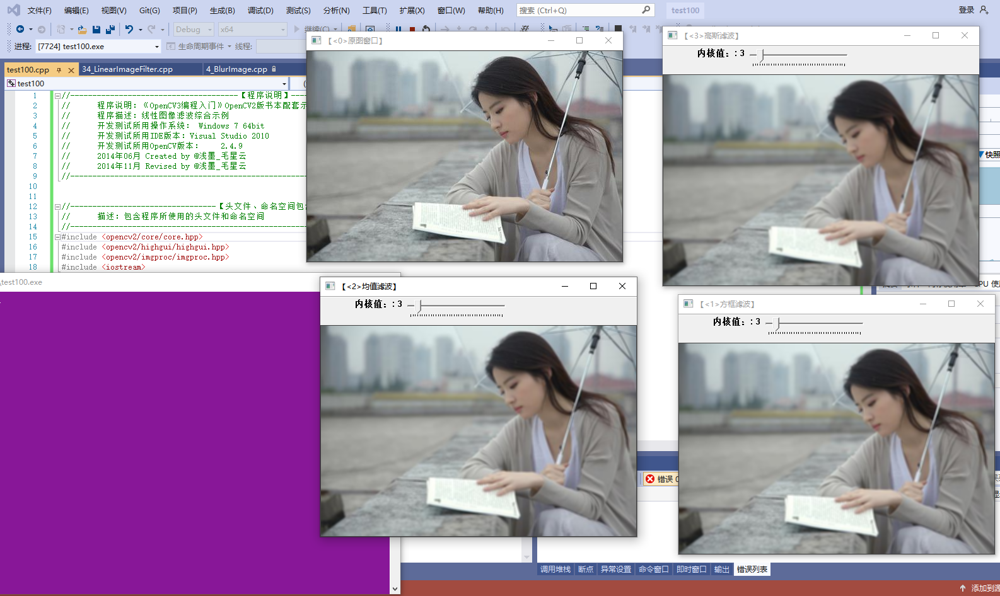

## 1.2. 五个函数的模糊处理

    新增BilateralFilter函数和medianBlur函数
    代码展示

 ```c++
//--------------------------------------【程序说明】-------------------------------------------
//		程序说明：《OpenCV3编程入门》OpenCV2版书本配套示例程序37
//		程序描述：五种图像滤波综合示例
//		开发测试所用操作系统： Windows 7 64bit
//		开发测试所用IDE版本：Visual Studio 2010
//		开发测试所用OpenCV版本：	2.4.9
//		2014年06月 Created by @浅墨_毛星云
//		2014年11月 Revised by @浅墨_毛星云
//------------------------------------------------------------------------------------------------

//-----------------------------------【头文件包含部分】---------------------------------------
//		描述：包含程序所依赖的头文件
//---------------------------------------------------------------------------------------------- 
# 2. include <opencv2/core/core.hpp>
# 3. include <opencv2/highgui/highgui.hpp>
# 4. include <opencv2/imgproc/imgproc.hpp>
# 5. include <iostream>

//-----------------------------------【命名空间声明部分】---------------------------------------
//		描述：包含程序所使用的命名空间
//-----------------------------------------------------------------------------------------------  
using namespace std;
using namespace cv;


//-----------------------------------【全局变量声明部分】--------------------------------------
//		描述：全局变量声明
//-----------------------------------------------------------------------------------------------
Mat g_srcImage, g_dstImage1, g_dstImage2, g_dstImage3, g_dstImage4, g_dstImage5;
int g_nBoxFilterValue = 6;  //方框滤波内核值
int g_nMeanBlurValue = 10;  //均值滤波内核值
int g_nGaussianBlurValue = 6;  //高斯滤波内核值
int g_nMedianBlurValue = 10;  //中值滤波参数值
int g_nBilateralFilterValue = 10;  //双边滤波参数值


//-----------------------------------【全局函数声明部分】--------------------------------------
//		描述：全局函数声明
//-----------------------------------------------------------------------------------------------
//轨迹条回调函数
static void on_BoxFilter(int, void*);		//方框滤波
static void on_MeanBlur(int, void*);		//均值块滤波器
static void on_GaussianBlur(int, void*);			//高斯滤波器
static void on_MedianBlur(int, void*);			//中值滤波器
static void on_BilateralFilter(int, void*);			//双边滤波器
void ShowHelpText();


//-----------------------------------【main( )函数】--------------------------------------------
//		描述：控制台应用程序的入口函数，我们的程序从这里开始
//-----------------------------------------------------------------------------------------------
int main()
{
	system("color 4F");

	ShowHelpText();

	// 载入原图
	g_srcImage = imread("liu.jpg", 1);
	if (!g_srcImage.data) { printf("读取srcImage错误~！ \n"); return false; }

	//克隆原图到四个Mat类型中
	g_dstImage1 = g_srcImage.clone();
	g_dstImage2 = g_srcImage.clone();
	g_dstImage3 = g_srcImage.clone();
	g_dstImage4 = g_srcImage.clone();
	g_dstImage5 = g_srcImage.clone();

	//显示原图
	namedWindow("【<0>原图窗口】", 1);
	imshow("【<0>原图窗口】", g_srcImage);


	//=================【<1>方框滤波】=========================
	//创建窗口
	namedWindow("【<1>方框滤波】", 1);
	//创建轨迹条
	createTrackbar("内核值：", "【<1>方框滤波】", &g_nBoxFilterValue, 50, on_BoxFilter);
	on_MeanBlur(g_nBoxFilterValue, 0);
	imshow("【<1>方框滤波】", g_dstImage1);
	//=====================================================


	//=================【<2>均值滤波】==========================
	//创建窗口
	namedWindow("【<2>均值滤波】", 1);
	//创建轨迹条
	createTrackbar("内核值：", "【<2>均值滤波】", &g_nMeanBlurValue, 50, on_MeanBlur);
	on_MeanBlur(g_nMeanBlurValue, 0);
	//======================================================


	//=================【<3>高斯滤波】===========================
	//创建窗口
	namedWindow("【<3>高斯滤波】", 1);
	//创建轨迹条
	createTrackbar("内核值：", "【<3>高斯滤波】", &g_nGaussianBlurValue, 50, on_GaussianBlur);
	on_GaussianBlur(g_nGaussianBlurValue, 0);
	//=======================================================


	//=================【<4>中值滤波】===========================
	//创建窗口
	namedWindow("【<4>中值滤波】", 1);
	//创建轨迹条
	createTrackbar("参数值：", "【<4>中值滤波】", &g_nMedianBlurValue, 50, on_MedianBlur);
	on_MedianBlur(g_nMedianBlurValue, 0);
	//=======================================================


	//=================【<5>双边滤波】===========================
	//创建窗口
	namedWindow("【<5>双边滤波】", 1);
	//创建轨迹条
	createTrackbar("参数值：", "【<5>双边滤波】", &g_nBilateralFilterValue, 50, on_BilateralFilter);
	on_BilateralFilter(g_nBilateralFilterValue, 0);
	//=======================================================


	//输出一些帮助信息
	cout << endl << "\t运行成功，请调整滚动条观察图像效果~\n\n"
		<< "\t按下“q”键时，程序退出。\n";
	while (char(waitKey(1)) != 'q') {}

	return 0;
}

//-----------------------------【on_BoxFilter( )函数】------------------------------------
//		描述：方框滤波操作的回调函数
//-----------------------------------------------------------------------------------------------
static void on_BoxFilter(int, void*)
{
	//方框滤波操作
	boxFilter(g_srcImage, g_dstImage1, -1, Size(g_nBoxFilterValue + 1, g_nBoxFilterValue + 1));
	//显示窗口
	imshow("【<1>方框滤波】", g_dstImage1);
}

//-----------------------------【on_MeanBlur( )函数】------------------------------------
//		描述：均值滤波操作的回调函数
//-----------------------------------------------------------------------------------------------
static void on_MeanBlur(int, void*)
{
	blur(g_srcImage, g_dstImage2, Size(g_nMeanBlurValue + 1, g_nMeanBlurValue + 1), Point(-1, -1));
	imshow("【<2>均值滤波】", g_dstImage2);

}

//-----------------------------【on_GaussianBlur( )函数】------------------------------------
//		描述：高斯滤波操作的回调函数
//-----------------------------------------------------------------------------------------------
static void on_GaussianBlur(int, void*)
{
	GaussianBlur(g_srcImage, g_dstImage3, Size(g_nGaussianBlurValue * 2 + 1, g_nGaussianBlurValue * 2 + 1), 0, 0);
	imshow("【<3>高斯滤波】", g_dstImage3);
}


//-----------------------------【on_MedianBlur( )函数】------------------------------------
//		描述：中值滤波操作的回调函数
//-----------------------------------------------------------------------------------------------
static void on_MedianBlur(int, void*)
{
	medianBlur(g_srcImage, g_dstImage4, g_nMedianBlurValue * 2 + 1);
	imshow("【<4>中值滤波】", g_dstImage4);
}


//-----------------------------【on_BilateralFilter( )函数】------------------------------------
//		描述：双边滤波操作的回调函数
//-----------------------------------------------------------------------------------------------
static void on_BilateralFilter(int, void*)
{
	bilateralFilter(g_srcImage, g_dstImage5, g_nBilateralFilterValue, g_nBilateralFilterValue * 2, g_nBilateralFilterValue / 2);
	imshow("【<5>双边滤波】", g_dstImage5);
}

//-----------------------------------【ShowHelpText( )函数】-----------------------------
//		 描述：输出一些帮助信息
//----------------------------------------------------------------------------------------------
void ShowHelpText()
{
	//输出欢迎信息和OpenCV版本
	printf("\n\n\t\t\t非常感谢购买《OpenCV3编程入门》一书！\n");
	printf("\n\n\t\t\t此为本书OpenCV2版的第37个配套示例程序\n");
	printf("\n\n\t\t\t   当前使用的OpenCV版本为：" CV_VERSION);
	printf("\n\n  ----------------------------------------------------------------------------\n");
}


```


## 膨胀与腐蚀

    腐蚀和膨胀都是对白色（高亮）部分而言，不是黑色部分。膨胀是图像中的高亮部分进行膨胀，类似于"领域扩张"效果图拥有比原图更大的高亮部分：腐蚀是原图中的高亮部分被腐蚀，类似于“领域被蝉食”，效果图拥有比原图更小的高亮区域。
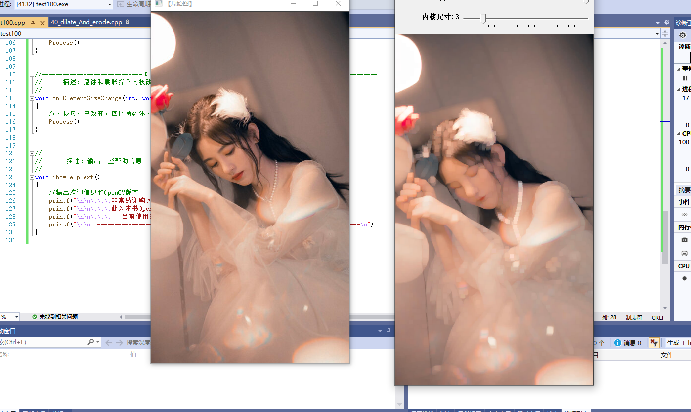
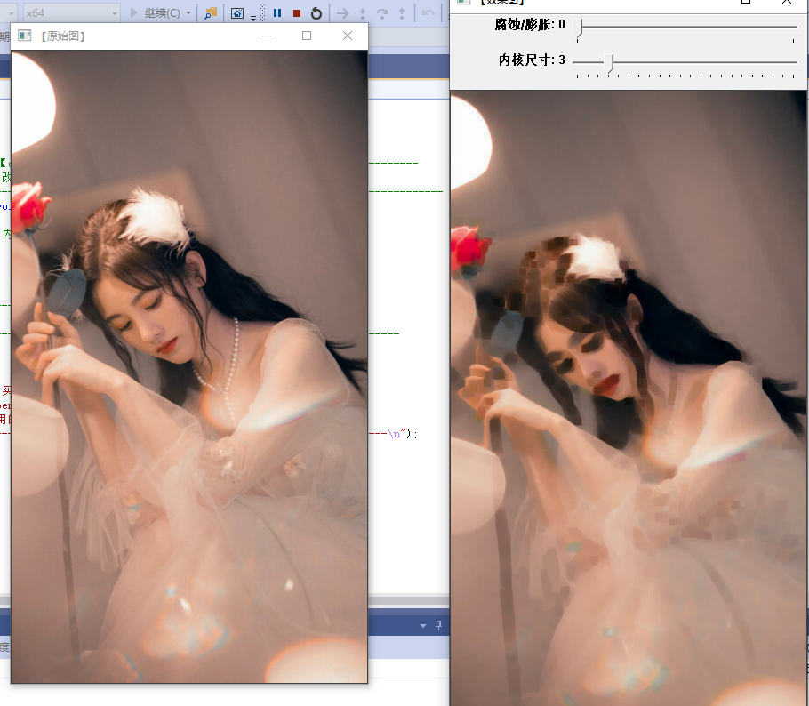

## 形态学滤波

### 开运算，闭运算，形态学梯度，顶帽，黑帽

遇到问题：出现为定义未识别代码段。需加入特定的包

```C++

# 6. include<opencv2/imgproc/types_c.h>
# 7. include<opencv2/opencv.hpp>
# 8. include <opencv2/highgui/highgui_c.h>
```

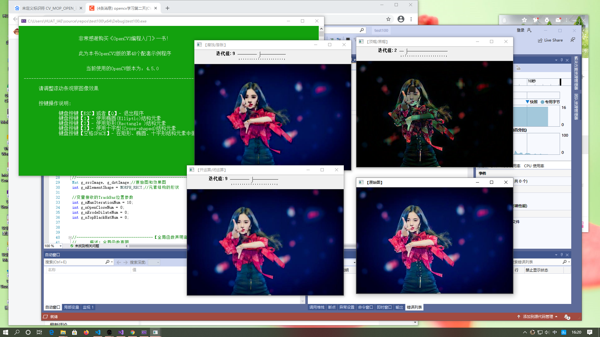

## 漫水算法

漫水算法是一种类似于PHOTOSHOP上魔法棒的算法，可以寻找和种子像素联通的相近色素点。
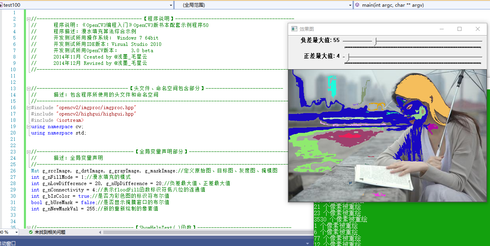

## 图像的金字塔缩放

   利用高斯
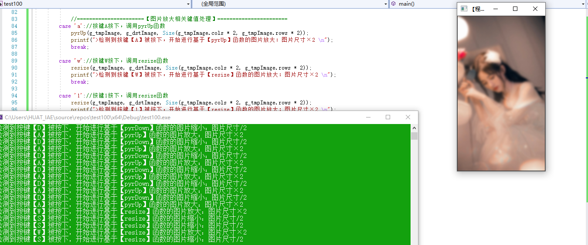

## 阀值化

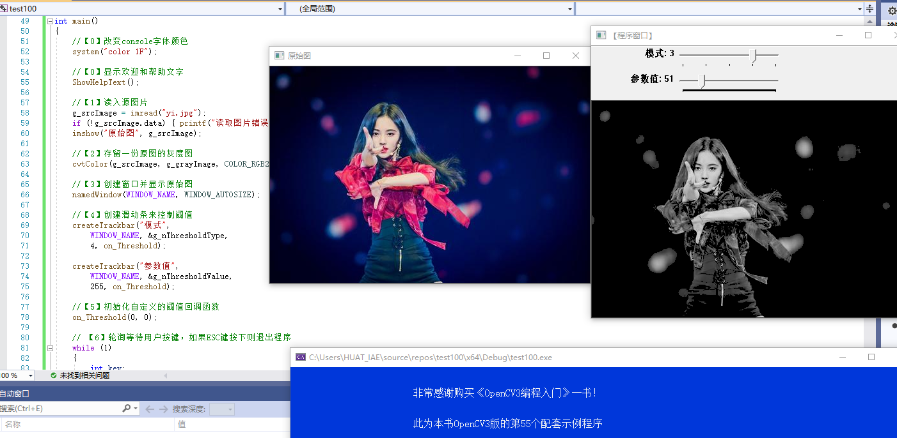

## 边缘检测计算

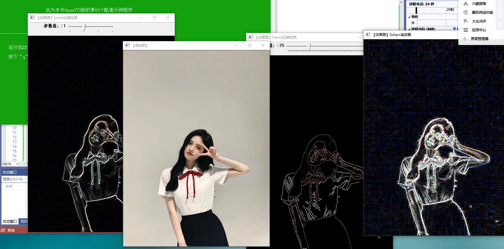

## 三色直方图

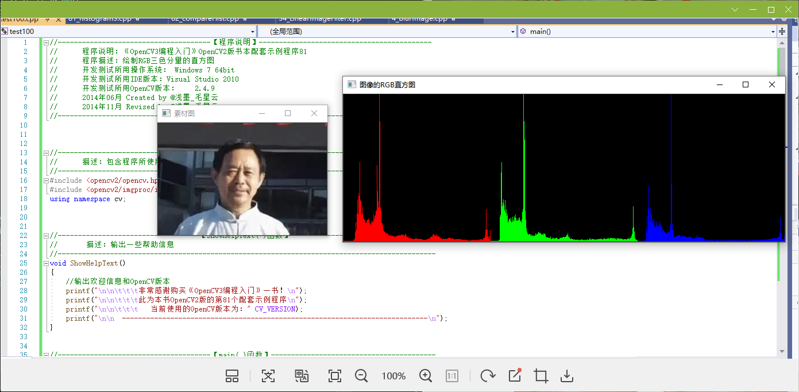

## 分水岭算法

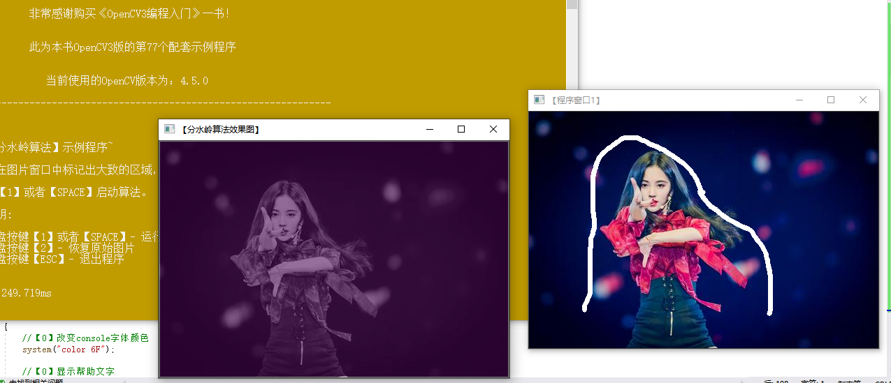

## HOUGH变换

```c++

//--------------------------------------【程序说明】-------------------------------------------
//		程序说明：《OpenCV3编程入门》OpenCV2版书本配套示例程序64
//		程序描述：霍夫线变换综合示例
//		开发测试所用操作系统： Windows 7 64bit
//		开发测试所用IDE版本：Visual Studio 2010
//		开发测试所用OpenCV版本：	2.4.9
//		2014年06月 Created by @浅墨_毛星云
//		2014年11月 Revised by @浅墨_毛星云
//------------------------------------------------------------------------------------------------


//---------------------------------【头文件、命名空间包含部分】----------------------------
//		描述：包含程序所使用的头文件和命名空间
//------------------------------------------------------------------------------------------------
# 9. include <opencv2/opencv.hpp>
# 10. include <opencv2/highgui/highgui.hpp>
# 11. include <opencv2/imgproc/imgproc.hpp>
using namespace std;
using namespace cv;


//-----------------------------------【全局变量声明部分】--------------------------------------
//		描述：全局变量声明
//-----------------------------------------------------------------------------------------------
Mat g_srcImage, g_dstImage, g_midImage;//原始图、中间图和效果图
vector<Vec4i> g_lines;//定义一个矢量结构g_lines用于存放得到的线段矢量集合
//变量接收的TrackBar位置参数
int g_nthreshold = 100;

//-----------------------------------【全局函数声明部分】--------------------------------------
//		描述：全局函数声明
//-----------------------------------------------------------------------------------------------

static void on_HoughLines(int, void*);//回调函数
static void ShowHelpText();


//-----------------------------------【main( )函数】--------------------------------------------
//		描述：控制台应用程序的入口函数，我们的程序从这里开始
//-----------------------------------------------------------------------------------------------
int main()
{
	//改变console字体颜色
	system("color 4F");

	ShowHelpText();

	//载入原始图和Mat变量定义   
	Mat g_srcImage = imread("jing.jpg");  //工程目录下应该有一张名为1.jpg的素材图

	//显示原始图  
	imshow("【原始图】", g_srcImage);

	//创建滚动条
	namedWindow("【效果图】", 1);
	createTrackbar("值", "【效果图】", &g_nthreshold, 200, on_HoughLines);

	//进行边缘检测和转化为灰度图
	Canny(g_srcImage, g_midImage, 50, 200, 3);//进行一次canny边缘检测
	cvtColor(g_midImage, g_dstImage, CV_GRAY2BGR);//转化边缘检测后的图为灰度图

	//调用一次回调函数，调用一次HoughLinesP函数
	on_HoughLines(g_nthreshold, 0);
	HoughLinesP(g_midImage, g_lines, 1, CV_PI / 180, 80, 50, 10);

	//显示效果图  
	imshow("【效果图】", g_dstImage);


	waitKey(0);

	return 0;

}


//-----------------------------------【on_HoughLines( )函数】--------------------------------
//		描述：【顶帽运算/黑帽运算】窗口的回调函数
//----------------------------------------------------------------------------------------------
static void on_HoughLines(int, void*)
{
	//定义局部变量储存全局变量
	Mat dstImage = g_dstImage.clone();
	Mat midImage = g_midImage.clone();

	//调用HoughLinesP函数
	vector<Vec4i> mylines;
	HoughLinesP(midImage, mylines, 1, CV_PI / 180, g_nthreshold + 1, 50, 10);

	//循环遍历绘制每一条线段
	for (size_t i = 0; i < mylines.size(); i++)
	{
		Vec4i l = mylines[i];
		line(dstImage, Point(l[0], l[1]), Point(l[2], l[3]), Scalar(23, 180, 55), 1, CV_AA);
	}
	//显示图像
	imshow("【效果图】", dstImage);
}

//-----------------------------------【ShowHelpText( )函数】----------------------------------
//		描述：输出一些帮助信息
//----------------------------------------------------------------------------------------------
static void ShowHelpText()
{
	//输出欢迎信息和OpenCV版本
	printf("\n\n\t\t\t非常感谢购买《OpenCV3编程入门》一书！\n");
	printf("\n\n\t\t\t此为本书OpenCV2版的第64个配套示例程序\n");
	printf("\n\n\t\t\t   当前使用的OpenCV版本为：" CV_VERSION);
	printf("\n\n  ----------------------------------------------------------------------------\n");

	//输出一些帮助信息
	printf("\n\n\n\t请调整滚动条观察图像效果~\n\n");


}
```

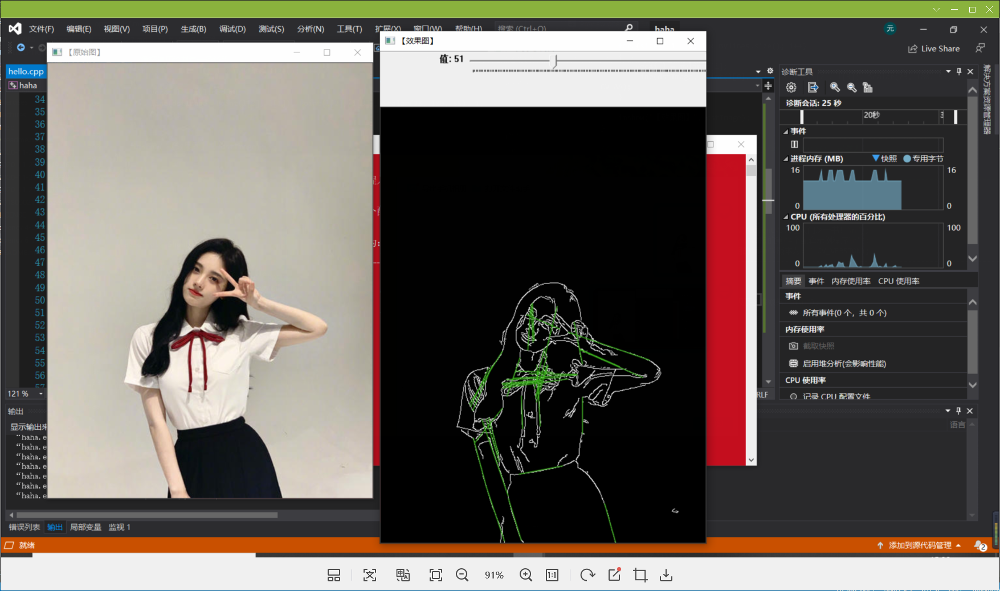

## 查找并绘制物体轮廓

```c++

//--------------------------------------【程序说明】-------------------------------------------
//		程序说明：《OpenCV3编程入门》OpenCV2版书本配套示例程序70
//		程序描述：查找并绘制轮廓综合示例
//		开发测试所用操作系统： Windows 7 64bit
//		开发测试所用IDE版本：Visual Studio 2010
//		开发测试所用OpenCV版本：	2.4.9
//		2014年06月 Created by @浅墨_毛星云
//		2014年11月 Revised by @浅墨_毛星云
//------------------------------------------------------------------------------------------------


//---------------------------------【头文件、命名空间包含部分】----------------------------
//		描述：包含程序所使用的头文件和命名空间
//------------------------------------------------------------------------------------------------
# 12. include "opencv2/highgui/highgui.hpp"
# 13. include "opencv2/imgproc/imgproc.hpp"
# 14. include <iostream>
using namespace cv;
using namespace std;


//-----------------------------------【宏定义部分】-------------------------------------------- 
//		描述：定义一些辅助宏 
//------------------------------------------------------------------------------------------------ 
# 15. define WINDOW_NAME1 "【原始图窗口】"			//为窗口标题定义的宏 
# 16. define WINDOW_NAME2 "【轮廓图】"					//为窗口标题定义的宏 


//-----------------------------------【全局变量声明部分】--------------------------------------
//		描述：全局变量的声明
//-----------------------------------------------------------------------------------------------
Mat g_srcImage;
Mat g_grayImage;
int g_nThresh = 80;
int g_nThresh_max = 255;
RNG g_rng(12345);
Mat g_cannyMat_output;
vector<vector<Point>> g_vContours;
vector<Vec4i> g_vHierarchy;


//-----------------------------------【全局函数声明部分】--------------------------------------
//		描述：全局函数的声明
//-----------------------------------------------------------------------------------------------
static void ShowHelpText();
void on_ThreshChange(int, void*);


//-----------------------------------【main( )函数】--------------------------------------------
//		描述：控制台应用程序的入口函数，我们的程序从这里开始执行
//-----------------------------------------------------------------------------------------------
int main(int argc, char** argv)
{
	//【0】改变console字体颜色
	system("color 1F");

	//【0】显示欢迎和帮助文字
	ShowHelpText();

	// 加载源图像
	g_srcImage = imread("yi.jpg", 1);
	if (!g_srcImage.data) { printf("读取图片错误，请确定目录下是否有imread函数指定的图片存在~！ \n"); return false; }

	// 转成灰度并模糊化降噪
	cvtColor(g_srcImage, g_grayImage, CV_BGR2GRAY);
	blur(g_grayImage, g_grayImage, Size(3, 3));

	// 创建窗口
	namedWindow(WINDOW_NAME1, CV_WINDOW_AUTOSIZE);
	imshow(WINDOW_NAME1, g_srcImage);

	//创建滚动条并初始化
	createTrackbar("canny阈值", WINDOW_NAME1, &g_nThresh, g_nThresh_max, on_ThreshChange);
	on_ThreshChange(0, 0);

	waitKey(0);
	return(0);
}

//-----------------------------------【on_ThreshChange( )函数】------------------------------  
//      描述：回调函数
//----------------------------------------------------------------------------------------------  
void on_ThreshChange(int, void*)
{

	// 用Canny算子检测边缘
	Canny(g_grayImage, g_cannyMat_output, g_nThresh, g_nThresh * 2, 3);

	// 寻找轮廓
	findContours(g_cannyMat_output, g_vContours, g_vHierarchy, CV_RETR_TREE, CV_CHAIN_APPROX_SIMPLE, Point(0, 0));

	// 绘出轮廓
	Mat drawing = Mat::zeros(g_cannyMat_output.size(), CV_8UC3);
	for (int i = 0; i < g_vContours.size(); i++)
	{
		Scalar color = Scalar(g_rng.uniform(0, 255), g_rng.uniform(0, 255), g_rng.uniform(0, 255));//任意值
		drawContours(drawing, g_vContours, i, color, 2, 8, g_vHierarchy, 0, Point());
	}

	// 显示效果图
	imshow(WINDOW_NAME2, drawing);
}


//-----------------------------------【ShowHelpText( )函数】----------------------------------  
//      描述：输出一些帮助信息  
//----------------------------------------------------------------------------------------------  
static void ShowHelpText()
{
	//输出欢迎信息和OpenCV版本
	printf("\n\n\t\t\t非常感谢购买《OpenCV3编程入门》一书！\n");
	printf("\n\n\t\t\t此为本书OpenCV2版的第70个配套示例程序\n");
	printf("\n\n\t\t\t   当前使用的OpenCV版本为：" CV_VERSION);
	printf("\n\n  ----------------------------------------------------------------------------\n");

	//输出一些帮助信息  
	printf("\n\n\t欢迎来到【在图形中寻找轮廓】示例程序~\n\n");
	printf("\n\n\t按键操作说明: \n\n"
		"\t\t键盘按键任意键- 退出程序\n\n"
		"\t\t滑动滚动条-改变阈值\n");
}

```


## 凸包检测


## 总结

   本次课学习了对图片的一些处理算法，包括模糊处理.膨胀腐蚀.线性滤波.形态学滤波。通过这些算法我们可以实现一些PS的基本操作。


